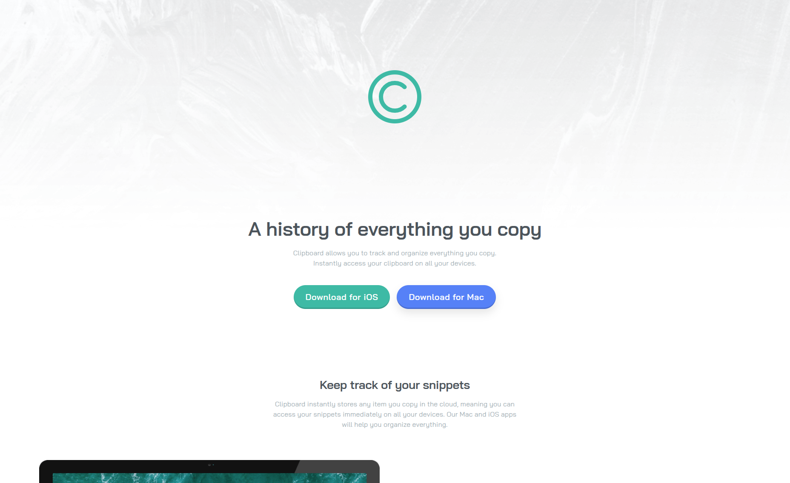

# Frontend Mentor - Clipboard landing page solution

This is a solution to the [Clipboard landing page challenge on Frontend Mentor](https://www.frontendmentor.io/challenges/clipboard-landing-page-5cc9bccd6c4c91111378ecb9). Frontend Mentor challenges help you improve your coding skills by building realistic projects. 

## Table of contents

- [Overview](#overview)
  - [The challenge](#the-challenge)
  - [Screenshot](#screenshot)
  - [Links](#links)
- [My process](#my-process)
  - [Built with](#built-with)
  - [What I learned](#what-i-learned)
- [Author](#author)

## Overview

### The challenge

Users should be able to:

- View the optimal layout for the site depending on their device's screen size
- See hover states for all interactive elements on the page

### Screenshot



### Links

- Solution URL: [Source Code](https://github.com/elhuzain/clipboard-landing-page)
- Live Site URL: [Live Preview](https://clipboard-landing-page.elhuzain.com)

## My process

### Built with

- Semantic HTML5 markup
- CSS custom properties
- Flexbox
- CSS Grid
- Mobile-first workflow
- [TailwindCSS](https://tailwindcss.com/) - CSS library

### What I learned

Simple project. I selected it to further practice mobile-first, tailwind on native html, with spacing, responsivness, and base styles preparation.

I'd initially set the mobile styles
```html
<div class="flex flex-col">
```

Then, on another iteration, I'd define tablet and desktop styles
```html
<div class="flex flex-col md:flex-row">
```

## Author

- Website - [elhuzain.com](https://elhuzain.com)
- Frontend Mentor - [@elhuzain](https://www.frontendmentor.io/profile/elhuzain)
